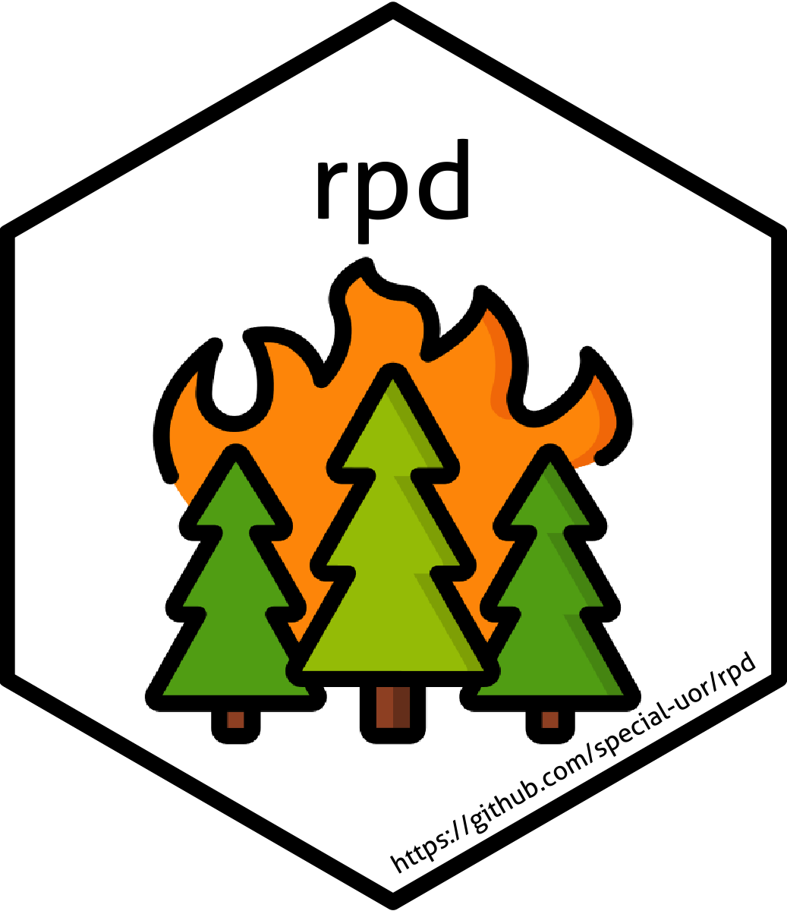

<!-- README.md is generated from README.Rmd. Please edit that file -->

# rpdata: Reading Palaeofire Database 

<!-- badges: start -->

[](https://github.com/special-uor/rpdata)
[](https://github.com/special-uor/rpdata/actions)
[](https://cran.r-project.org/package=rpdata)
<!-- badges: end -->

The goal of `rpdata` is to provide access to the Reading Palaeofire
Database.

## Installation

You can(not) install the released version of rpdata from
[CRAN](https://CRAN.R-project.org) with:

``` r
install.packages("rpdata")
```

And the development version from
[GitHub](https://github.com/special-uor/rpdata) with:

``` r
# install.packages("remotes")
remotes::install_github("special-uor/rpdata", "dev")
```

## Example

#### Load tables to working environment

``` r
data("site", package = "rpdata")
data("entity", package = "rpdata")
data("date_info", package = "rpdata")
data("sample", package = "rpdata")
```

#### Find entities link to sites

``` r
`%>%` <- rpdata::`%>%`
ents <- site %>%
  dplyr::slice(1:4) %>%
  rpdata::get_entities()

ents %>%
  knitr::kable()
```

| ID\_SITE | ID\_ENTITY | entity\_name           | latitude | longitude | elevation | depositional\_context | measurement\_method | TYPE          | source                             | core\_location | last\_updated | ID\_UNIT |
| -------: | ---------: | :--------------------- | -------: | --------: | --------: | :-------------------- | :------------------ | :------------ | :--------------------------------- | :------------- | :------------ | -------: |
|        1 |          1 | Cygnet core            | 44.66000 | \-110.610 |      2530 | lake sediment         | Sieved              | concentration | Global Charcoal Database Version 4 | \-777777       | 2020-03-06    |       11 |
|        2 |          4 | Slough Creek Pond core | 44.91000 | \-110.340 |      1884 | lake sediment         | Sieved              | concentration | Global Charcoal Database Version 4 | \-777777       | 2020-03-06    |       11 |
|        3 |          5 | Burnt Knob core        | 45.70000 | \-114.980 |      2250 | lake sediment         | Sieved              | influx        | IMPD                               | central core   | 2021-05-07    |       10 |
|        4 |          6 | Baker core             | 45.89178 | \-114.263 |      2300 | lake sediment         | Sieved              | influx        | Global Charcoal Database Version 4 | central core   | 2021-05-07    |       10 |
